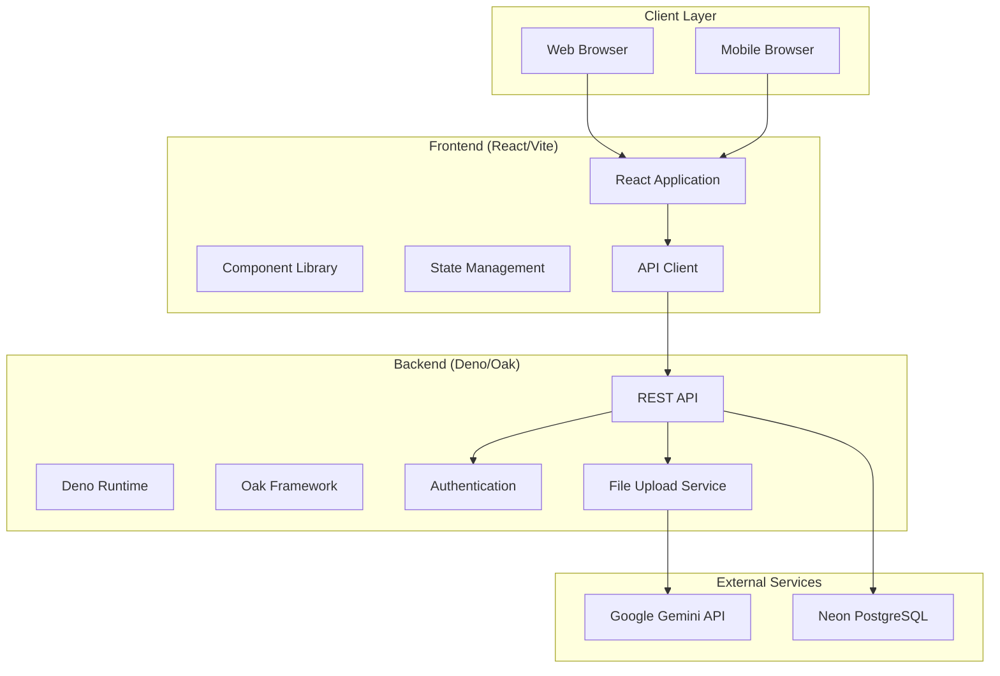
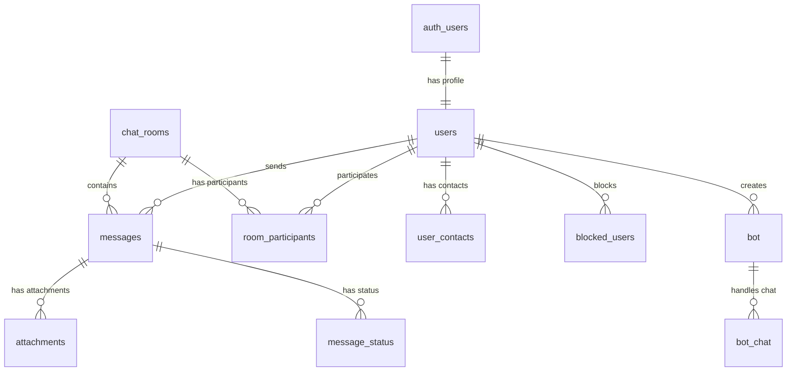
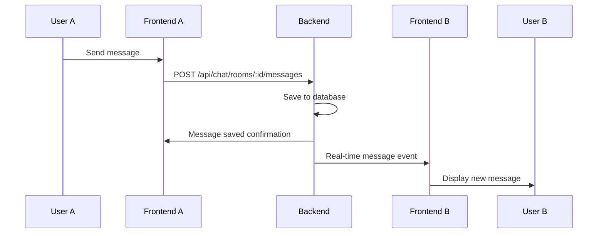
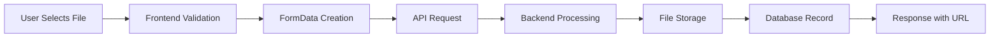

# ChitChat Application - Project Documentation

## Table of Contents

1. [Overview](#overview)
2. [Architecture](#architecture)
3. [Technology Stack](#technology-stack)
4. [Project Structure](#project-structure)
5. [Features](#features)
6. [Database Design](#database-design)
7. [API Specification](#api-specification)
8. [Authentication & Authorization](#authentication--authorization)
9. [Components & UI](#components--ui)
10. [Real-time Communication](#real-time-communication)
11. [File Upload System](#file-upload-system)
12. [Bot Integration](#bot-integration)
13. [Security Considerations](#security-considerations)
14. [Performance Optimizations](#performance-optimizations)
15. [Development Workflow](#development-workflow)
16. [Testing Strategy](#testing-strategy)
17. [Deployment](#deployment)

---

## Overview

ChitChat is a modern, real-time chat application built with a decoupled frontend-backend architecture. The application provides instant messaging capabilities, group chats, AI bot integration, file sharing, and comprehensive user management features.

### Key Characteristics

- **Real-time Messaging**: Instant message delivery and status updates
- **Cross-platform**: Web-based application accessible from any device
- **AI Integration**: Built-in Google Gemini AI bot with custom bot support
- **File Sharing**: Image and file upload capabilities
- **User Management**: Authentication, profiles, contacts, and blocking
- **Group Chats**: Support for multi-user conversations
- **Modern UI**: Responsive design with Tailwind CSS

---

## Architecture

### High-Level Architecture



### Design Patterns

- **Model-View-Controller (MVC)**: Backend follows MVC pattern with controllers, services, and models
- **Component-Based Architecture**: Frontend uses React components with props and state management
- **Service Layer Pattern**: Business logic separated into service classes
- **Repository Pattern**: Data access abstracted through service layers
- **Observer Pattern**: Real-time updates through event-driven communication

---

## Technology Stack

### Frontend
| Technology | Version | Purpose |
|------------|---------|---------|
| **React** | 19.1.0 | UI library for component-based development |
| **TypeScript** | 5.7.2 | Type safety and enhanced developer experience |
| **Vite** | 6.2.0 | Fast build tool and development server |
| **Tailwind CSS** | - | Utility-first CSS framework for styling |

### Backend
| Technology | Version | Purpose |
|------------|---------|---------|
| **Deno** | 1.40+ | Modern JavaScript/TypeScript runtime |
| **Oak** | 12.6.1 | Web framework for Deno |
| **PostgreSQL** | Latest | Relational database via Neon cloud |
| **JWT (Jose)** | 5.6.3 | Authentication token management |
| **bcrypt** | 0.4.1 | Password hashing |
| **Zod** | 3.22.4 | Runtime type validation |

### External Services
- **Neon PostgreSQL**: Cloud-hosted PostgreSQL database
- **Google Gemini AI**: AI chatbot integration
- **Local File Storage**: Static file serving for uploads

---

## Project Structure

```
chichat-app/
├── frontend/                    # React Frontend Application
│   ├── components/             # React Components
│   │   ├── auth/              # Authentication components
│   │   │   ├── AuthPage.tsx
│   │   │   ├── SignInForm.tsx
│   │   │   └── SignUpForm.tsx
│   │   ├── chat/              # Chat-related components
│   │   │   ├── ChatView.tsx
│   │   │   ├── GeminiChatView.tsx
│   │   │   ├── MessageBubble.tsx
│   │   │   ├── ChatInput.tsx
│   │   │   ├── MemberList.tsx
│   │   │   └── WelcomeView.tsx
│   │   ├── layout/            # Layout components
│   │   │   ├── MainLayout.tsx
│   │   │   ├── FarLeftSidebar.tsx
│   │   │   ├── MainSidebar.tsx
│   │   │   └── TopBar.tsx
│   │   ├── modals/            # Modal components
│   │   │   ├── ConfigureBotModal.tsx
│   │   │   ├── UserProfileModal.tsx
│   │   │   ├── FindFriendsModal.tsx
│   │   │   └── NotificationsModal.tsx
│   │   └── common/            # Shared components
│   │       └── FileUpload.tsx
│   ├── services/              # API and external services
│   │   ├── apiService.ts
│   │   └── geminiService.ts
│   ├── hooks/                 # Custom React hooks
│   │   └── useUploadStatus.ts
│   ├── utils/                 # Utility functions
│   │   └── uploadUtils.ts
│   ├── types.ts               # TypeScript type definitions
│   ├── constants.ts           # Application constants
│   ├── App.tsx               # Main application component
│   ├── index.tsx             # Application entry point
│   ├── package.json          # Dependencies and scripts
│   ├── vite.config.ts        # Vite configuration
│   ├── tsconfig.json         # TypeScript configuration
│   └── .env.local            # Environment variables
│
├── backend/                   # Deno Backend Application
│   ├── src/
│   │   ├── controllers/       # Request handlers
│   │   │   ├── auth.controller.ts
│   │   │   ├── chat.controller.ts
│   │   │   ├── user.controller.ts
│   │   │   └── upload.controller.ts
│   │   ├── services/          # Business logic
│   │   │   ├── auth.service.ts
│   │   │   ├── chat.service.ts
│   │   │   ├── user.service.ts
│   │   │   └── upload.service.ts
│   │   ├── middleware/        # Middleware functions
│   │   │   ├── auth.middleware.ts
│   │   │   ├── cors.middleware.ts
│   │   │   ├── error.middleware.ts
│   │   │   └── logger.middleware.ts
│   │   ├── routes/           # API route definitions
│   │   │   ├── auth.routes.ts
│   │   │   ├── chat.routes.ts
│   │   │   ├── user.routes.ts
│   │   │   ├── upload.routes.ts
│   │   │   ├── data.routes.ts
│   │   │   └── index.ts
│   │   ├── config/           # Configuration files
│   │   │   ├── database.ts
│   │   │   └── env.ts
│   │   ├── types/            # Type definitions
│   │   │   └── index.ts
│   │   └── utils/            # Utility functions
│   │       ├── hash.ts
│   │       └── jwt.ts
│   ├── uploads/              # Static file storage
│   ├── main.ts               # Application entry point
│   ├── deno.json             # Deno configuration
│   └── README.md             # Backend documentation
│
├── neon-chat-schema.sql       # Database schema
├── chitchat-deno-nextjs-doc.md # Technical documentation
└── INTEGRATION_TEST.md        # Integration testing guide
```

---

## Features

### Core Features

1. **User Authentication**
   - Email/password registration and login
   - JWT-based session management
   - User profile management
   - Avatar upload functionality

2. **Real-time Messaging**
   - Instant message delivery
   - Message status indicators
   - Typing indicators
   - Message history

3. **Chat Management**
   - Direct messaging between users
   - Group chat creation and management
   - Chat participant management
   - Chat search and filtering

4. **AI Bot Integration**
   - Built-in Google Gemini AI bot
   - Custom bot creation and configuration
   - Bot conversation history
   - API key management for custom bots

5. **File Sharing**
   - Image upload and sharing
   - File attachment support
   - Profile picture uploads
   - Secure file storage

6. **User Management**
   - Contact list management
   - User search functionality
   - User blocking/unblocking
   - Online status indicators

### Advanced Features

1. **Chat Organization**
   - Chat tags and categorization
   - Chat room roles and permissions
   - Message search within chats
   - Chat archiving

2. **Notifications**
   - Real-time notification system
   - Friend request notifications
   - Message notifications

3. **Security**
   - Password hashing with bcrypt
   - JWT token validation
   - CORS protection
   - Input sanitization

---

## Database Design

### Entity Relationship Diagram

The application uses a PostgreSQL database hosted on Neon with the following key entities:



### Key Tables

1. **auth_users**: Authentication data with email and password hash
2. **users**: User profiles with personal information
3. **chat_rooms**: Chat room definitions (private/group)
4. **messages**: All chat messages with content and metadata
5. **room_participants**: User membership in chat rooms
6. **attachments**: File attachments for messages
7. **message_status**: Read receipts and delivery status
8. **user_contacts**: Friend/contact relationships
9. **blocked_users**: User blocking relationships
10. **bot**: AI bot configurations
11. **bot_chat**: Bot conversation history

### Database Features

- **UUID Primary Keys**: For better security and distributed systems
- **Indexes**: Optimized for common query patterns
- **Foreign Key Constraints**: Data integrity enforcement
- **Timestamps**: Audit trail for all records
- **Sequences**: Auto-incrementing IDs where appropriate

---

## API Specification

### Authentication Endpoints

| Method | Endpoint | Description | Authentication |
|--------|----------|-------------|----------------|
| POST | `/api/auth/register` | Register new user | None |
| POST | `/api/auth/login` | Login user | None |
| GET | `/api/auth/me` | Get current user | Required |
| POST | `/api/auth/logout` | Logout user | Required |

### User Management Endpoints

| Method | Endpoint | Description | Authentication |
|--------|----------|-------------|----------------|
| GET | `/api/users/search` | Search users | Required |
| GET | `/api/users/contacts` | Get user contacts | Required |
| PUT | `/api/users/me` | Update user profile | Required |

### Chat Endpoints

| Method | Endpoint | Description | Authentication |
|--------|----------|-------------|----------------|
| GET | `/api/chat/rooms` | Get user's chat rooms | Required |
| GET | `/api/chat/rooms/:id/messages` | Get chat messages | Required |
| POST | `/api/chat/rooms/:id/messages` | Send message | Required |
| GET | `/api/chat/rooms/:id/participants` | Get room participants | Required |

### Upload Endpoints

| Method | Endpoint | Description | Authentication |
|--------|----------|-------------|----------------|
| POST | `/api/upload/profile` | Upload profile image | Required |
| POST | `/api/upload/chat` | Upload chat image | Required |
| DELETE | `/api/upload/delete` | Delete uploaded file | Required |

### Data Bootstrap Endpoint

| Method | Endpoint | Description | Authentication |
|--------|----------|-------------|----------------|
| GET | `/api/data/bootstrap` | Get initial app data | Required |

---

## Authentication & Authorization

### JWT Token Management

The application uses JSON Web Tokens (JWT) for stateless authentication:

```typescript
// Token Structure
{
  "sub": "user_id",           // Subject (user ID)
  "exp": 1234567890,          // Expiration timestamp
  "iat": 1234567890           // Issued at timestamp
}
```

### Authentication Flow

1. **Registration/Login**: User provides credentials
2. **Token Generation**: Server creates JWT token
3. **Token Storage**: Client stores token securely
4. **Request Authorization**: Token sent in Authorization header
5. **Token Validation**: Server validates token on protected routes

### Security Features

- **Password Hashing**: bcrypt with salt rounds
- **Token Expiration**: 7-day token lifetime
- **CORS Protection**: Configurable origin restrictions
- **Input Validation**: Zod schema validation
- **Error Handling**: Secure error responses

---

## Components & UI

### Component Hierarchy

```
App
├── AuthPage (if not authenticated)
│   ├── SignInForm
│   └── SignUpForm
└── MainLayout (if authenticated)
    ├── FarLeftSidebar
    │   └── Navigation icons
    ├── MainSidebar
    │   ├── User profile section
    │   ├── Chat list
    │   └── Search functionality
    └── Main Content Area
        ├── TopBar
        ├── ChatView / GeminiChatView / WelcomeView
        └── MemberList (for group chats)
```

### Key Components

1. **App.tsx**: Root component managing authentication state
2. **MainLayout.tsx**: Main application layout with sidebar and content
3. **ChatView.tsx**: Standard chat interface
4. **GeminiChatView.tsx**: AI bot chat interface
5. **MessageBubble.tsx**: Individual message display
6. **ChatInput.tsx**: Message composition interface
7. **UserProfileModal.tsx**: User profile management

### State Management

- **React State**: Component-level state with useState/useEffect
- **Props**: Data flow through component props
- **Context**: User data passed through component tree
- **Local Storage**: Persistent user session and preferences

### UI Design Principles

- **Responsive Design**: Mobile-first approach
- **Component Reusability**: Modular, reusable components
- **Accessibility**: Semantic HTML and ARIA attributes
- **Performance**: Optimized rendering and lazy loading

---

## Real-time Communication

### Message Flow



### Real-time Features

- **Message Delivery**: Instant message transmission
- **Typing Indicators**: Show when users are typing
- **Online Status**: User presence indicators
- **Message Status**: Read receipts and delivery confirmation

### Implementation Approach

Currently implemented as API polling with plans for WebSocket integration:

1. **API-Based**: RESTful API calls for message operations
2. **Polling**: Periodic checks for new messages
3. **Future Enhancement**: WebSocket implementation for true real-time

---

## File Upload System

### Upload Architecture



### Upload Types

1. **Profile Images**: User avatar uploads
2. **Chat Images**: In-chat image sharing
3. **File Attachments**: Document and media sharing

### Features

- **File Type Validation**: MIME type checking
- **Size Limits**: Configurable upload size restrictions
- **Progress Tracking**: Upload progress indicators
- **Error Handling**: Comprehensive error management
- **Secure Storage**: Protected file access

### Storage Implementation

- **Local Storage**: Files stored in backend/uploads directory
- **Static Serving**: Files served through Oak static middleware
- **URL Generation**: Full URLs for file access
- **Cleanup**: Orphaned file removal

---

## Bot Integration

### Google Gemini Integration

The application integrates with Google's Gemini AI API for intelligent chatbot functionality:

```typescript
// Gemini Service Architecture
class GeminiService {
  // Default API key from environment
  private static DEFAULT_API_KEY = import.meta.env.GEMINI_API_KEY;
  
  // Main service method
  async getBotResponse(prompt: string, apiKey?: string): Promise<string>
}
```

### Bot Features

1. **Default Gemini Bot**: Pre-configured AI assistant
2. **Custom Bots**: User-created bots with custom API keys
3. **Bot Configuration**: Name, description, and API key management
4. **Conversation History**: Bot chat persistence
5. **Error Handling**: Graceful degradation for API issues

### Bot Types

- **Default Bot**: Uses environment API key
- **Custom Bots**: User-provided API keys and configurations
- **Fallback Handling**: Error messages for missing/invalid keys

---

## Security Considerations

### Authentication Security

- **Password Hashing**: bcrypt with proper salt rounds
- **JWT Tokens**: Secure token generation and validation
- **Token Expiration**: Automatic session timeout
- **Secure Headers**: CORS and security middleware

### Data Protection

- **Input Validation**: Zod schema validation for all inputs
- **SQL Injection Prevention**: Parameterized queries
- **XSS Protection**: Input sanitization
- **File Upload Security**: Type and size validation

### Access Control

- **Route Protection**: Authentication middleware
- **Resource Authorization**: User-specific data access
- **Role-Based Access**: Future implementation for admin roles
- **Rate Limiting**: API abuse prevention (planned)

---

## Performance Optimizations

### Frontend Optimizations

- **Component Memoization**: React.memo for expensive components
- **Lazy Loading**: Code splitting for route components
- **Image Optimization**: Proper image sizing and formats
- **Bundle Optimization**: Vite build optimizations

### Backend Optimizations

- **Database Indexing**: Optimized query performance
- **Connection Pooling**: Efficient database connections
- **Caching Strategy**: Future Redis implementation
- **Static File Serving**: Efficient file delivery

### Network Optimizations

- **API Response Compression**: Reduced payload sizes
- **Request Batching**: Minimized API calls
- **Image Compression**: Optimized file uploads
- **CDN Strategy**: Future content delivery optimization

---

## Development Workflow

### Development Environment

1. **Backend Setup**:
   ```bash
   cd backend
   deno task dev  # Starts development server with hot reload
   ```

2. **Frontend Setup**:
   ```bash
   cd frontend
   npm install
   npm run dev    # Starts Vite development server
   ```

### Code Quality

- **TypeScript**: Strict type checking enabled
- **ESLint**: Code linting and formatting
- **Prettier**: Consistent code formatting
- **Git Hooks**: Pre-commit validation

### Version Control

- **Git Flow**: Feature branches and pull requests
- **Commit Standards**: Conventional commit messages
- **Code Reviews**: Peer review process
- **Documentation**: Comprehensive README files

---

## Testing Strategy

### Frontend Testing

- **Unit Tests**: Component testing with Jest/Vitest
- **Integration Tests**: API integration testing
- **E2E Tests**: End-to-end user workflows
- **Visual Testing**: UI component screenshots

### Backend Testing

- **Unit Tests**: Service and utility function tests
- **Integration Tests**: Database and API tests
- **Load Testing**: Performance and scalability tests
- **Security Tests**: Authentication and authorization tests

### Test Coverage

- **Coverage Targets**: 80%+ code coverage goal
- **Critical Path Testing**: Authentication and messaging flows
- **Error Scenario Testing**: Edge cases and error conditions

---

## Deployment

### Environment Configuration

#### Frontend (.env.local)
```bash
# API Configuration
VITE_API_URL=http://localhost:8000

# Development
NODE_ENV=development

# Gemini API
GEMINI_API_KEY=your_api_key_here
```

#### Backend (.env)
```bash
# Database
DATABASE_URL=postgresql://connection_string

# Authentication
JWT_SECRET=your_jwt_secret
JWT_EXPIRY=7d

# Server
PORT=8000
CORS_ORIGIN=http://localhost:5173

# API Keys
GEMINI_API_KEY=your_gemini_api_key
```

### Deployment Options

1. **Development**:
   - Local development servers
   - Local PostgreSQL or Neon cloud database
   - Hot reload for rapid development

2. **Production**:
   - **Frontend**: Vercel, Netlify, or static hosting
   - **Backend**: Deno Deploy, Railway, or VPS
   - **Database**: Neon PostgreSQL cloud
   - **CDN**: Future implementation for static assets

### Scaling Considerations

- **Horizontal Scaling**: Load balancer for multiple backend instances
- **Database Scaling**: Read replicas and connection pooling
- **Caching Layer**: Redis for session and data caching
- **File Storage**: Migration to cloud storage (AWS S3, etc.)

---

## Future Enhancements

### Planned Features

1. **Real-time Updates**: WebSocket implementation
2. **Mobile Application**: React Native app
3. **Voice/Video Calls**: WebRTC integration
4. **File Sharing**: Enhanced file upload capabilities
5. **Themes**: Dark/light mode support
6. **Internationalization**: Multi-language support

### Technical Improvements

1. **Microservices**: Service decomposition
2. **Event Sourcing**: Event-driven architecture
3. **GraphQL**: Alternative API approach
4. **Progressive Web App**: PWA capabilities
5. **Offline Support**: Local data synchronization

---

This documentation provides a comprehensive overview of the ChitChat application architecture, features, and implementation details. For specific implementation questions or troubleshooting, refer to the individual component documentation and code comments.
